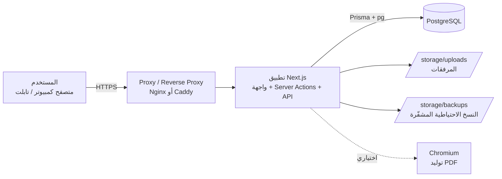
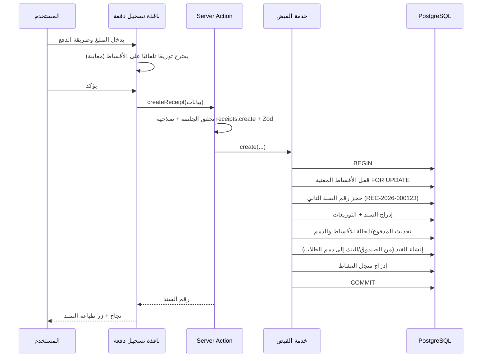

# 1. البنية المعمارية للنظام (Architecture)

## 1.1 نظرة عامة

النظام تطبيق ويب (لوحة تحكم) يعمل من المتصفح على الكمبيوتر والتابلت، ويتكوّن من:

- **خادم تطبيق واحد** (Next.js) يقدّم الواجهة ويحتوي منطق الأعمال بالكامل.
- **قاعدة بيانات PostgreSQL** هي المصدر الوحيد للحقيقة لكل البيانات المالية.
- **مجلد تخزين** للمرفقات والنسخ الاحتياطية.



## 1.2 التقنيات المختارة ولماذا

| الطبقة | التقنية | السبب |
|--------|---------|-------|
| الإطار | **Next.js 16 (App Router) + React 19** | واجهة وخادم في مشروع واحد، Server Components تقلل كود المتصفح، Server Actions محمية تلقائيًا من CSRF |
| اللغة | **TypeScript (strict)** | أنواع صارمة تمنع أخطاء المبالغ والحقول |
| قاعدة البيانات | **PostgreSQL 16+** | معاملات ACID، نوع `NUMERIC` للمبالغ، قيود وتريجرات، فهارس نصية للبحث العربي |
| الوصول للبيانات | **Prisma ORM 7** + `@prisma/adapter-pg` | استعلامات مُعاملة (Parameterized) تمنع SQL Injection، Migrations منظمة |
| التحقق من المدخلات | **Zod** | نفس مخطط التحقق في المتصفح والخادم |
| التصميم | **Tailwind CSS 4** + مكونات مبنية على **Radix UI** | RTL كامل، مكونات قابلة للوصول (Accessible) |
| الرسوم البيانية | **Recharts** | رسوم بسيطة وواضحة |
| Excel | **ExcelJS** | قراءة وكتابة xlsx مع دعم الاتجاه من اليمين لليسار والتنسيقات |
| PDF | صفحات طباعة HTML/CSS + **Chromium (اختياري)** | أدق طريقة لعرض النص العربي؛ عند عدم توفر Chromium يُستخدم حوار الطباعة «حفظ كـ PDF» |
| الحسابات العشرية | **decimal.js** | لا يتم استخدام الأعداد العشرية العائمة (float) في أي حساب مالي |
| الاختبارات | **Vitest** (اختبارات تكامل على قاعدة بيانات اختبار) | التحقق من صحة القيود والأرصدة |

## 1.3 طبقات النظام

```
src/
├── app/                     ← الصفحات (واجهة المستخدم) و API
│   ├── login/               ← تسجيل الدخول
│   ├── (app)/               ← كل صفحات لوحة التحكم (محمية بتسجيل الدخول)
│   ├── print/               ← صفحات الطباعة الرسمية (سندات، كشوف)
│   └── api/                 ← تنزيل الملفات، التصدير، البحث، القوالب
├── server/                  ← كود يعمل على الخادم فقط
│   ├── db.ts                ← اتصال Prisma
│   ├── auth/                ← كلمات المرور، الجلسات، القفل، الحماية
│   ├── permissions.ts       ← تعريف الصلاحيات والأدوار
│   ├── audit.ts             ← سجل النشاط
│   ├── numbering.ts         ← ترقيم السندات
│   ├── ledger/              ← المحرك المحاسبي (القيود، الحسابات، الأرصدة)
│   ├── services/            ← منطق الأعمال: الطلاب، الذمم، القبض، الصرف، الرواتب...
│   ├── reports/             ← تعريفات التقارير
│   ├── import/              ← محرك الاستيراد من Excel
│   └── backup/              ← النسخ الاحتياطي والاستعادة
├── lib/                     ← أدوات مشتركة: المبالغ، التواريخ، التفقيط، تطبيع النص العربي
└── components/              ← مكونات الواجهة
```

### قاعدة ذهبية للطبقات

1. **الصفحة** (Server Component) تتحقق من الصلاحية ثم تقرأ البيانات عبر الخدمات.
2. **الإجراء** (Server Action) يتحقق من: تسجيل الدخول ← الصلاحية ← صحة المدخلات (Zod) ← ثم يستدعي **الخدمة**.
3. **الخدمة** تنفّذ العملية كاملة داخل **معاملة واحدة** (Transaction): تحديث الجداول التشغيلية + القيد المحاسبي + سجل النشاط. إذا فشل أي جزء يُلغى كل شيء.
4. الواجهة لا تحسب أرصدة نهائية أبدًا؛ أي حساب في المتصفح هو «معاينة» فقط، والرقم المعتمد يحسبه الخادم ويحفظه.

## 1.4 تدفق عملية نموذجية (تسجيل دفعة طالب)



## 1.5 التعامل مع المبالغ

- تُخزن كل المبالغ في قاعدة البيانات بنوع `NUMERIC(15,3)` (لا نصوص ولا Float).
- كل العمليات الحسابية على الخادم تتم عبر `decimal.js` مع التقريب حسب عدد المنازل العشرية للعملة (الإعدادات)، وبقاعدة التقريب `ROUND_HALF_UP`.
- تقسيم المبالغ (الأقساط) يعطي باقي التقريب لآخر قسط بحيث يكون مجموع الأقساط مساويًا للمبلغ تمامًا.

## 1.6 التواريخ والمنطقة الزمنية

- التواريخ المالية (تاريخ السند، الاستحقاق...) تُخزن كنوع `DATE` بدون وقت، لتجنب مشاكل المناطق الزمنية.
- «اليوم» يُحسب حسب المنطقة الزمنية للمدرسة المحددة في الإعدادات.
- أوقات الإنشاء والتعديل تُخزن `TIMESTAMP` بتوقيت UTC وتُعرض بالتوقيت المحلي.

## 1.7 الأمان (ملخص؛ التفاصيل في الوثائق 4 و 9)

| التهديد | الحماية |
|---------|---------|
| سرقة كلمات المرور | تخزين كلمات المرور مشفرة باتجاه واحد بخوارزمية **scrypt** مع Salt عشوائي لكل مستخدم |
| سرقة الجلسة | رمز جلسة عشوائي 256-bit في Cookie من نوع `HttpOnly` + `Secure` + `SameSite=Lax`، ويُخزن في القاعدة **الهاش** فقط، مع انتهاء صلاحية وتجديد |
| تخمين كلمات المرور | قفل الحساب بعد 5 محاولات فاشلة (قابل للتعديل) لمدة 15 دقيقة + تسجيل كل محاولة دخول مع IP |
| SQL Injection | كل الاستعلامات عبر Prisma أو استعلامات SQL بمعاملات (Tagged templates) |
| XSS | React يهرّب كل النصوص تلقائيًا، منع `dangerouslySetInnerHTML`، ترويسة CSP |
| CSRF | Server Actions تتحقق من Origin تلقائيًا، وواجهات API تتحقق من Origin، والـ Cookie بنمط SameSite |
| تجاوز الصلاحيات | كل Action وكل API يتحقق من الصلاحية على الخادم (إخفاء الزر في الواجهة ليس حماية) |
| التلاعب بالسجلات | سجل النشاط Append-only محمي بتريجر في القاعدة يمنع التعديل والحذف |
| التلاعب بالأرقام | ترقيم متسلسل بلا فجوات، لا حذف للسندات، قيود عكسية فقط، قفل السنوات المغلقة |
| رفع ملفات خبيثة | التحقق من نوع الملف الفعلي (Magic bytes) والحجم، أسماء عشوائية، التخزين خارج المجلد العام، التنزيل عبر صلاحية |
| فقدان البيانات | نسخ احتياطي تلقائي مشفّر AES-256-GCM + يدوي + استعادة آمنة |

ترويسات HTTP الأمنية: `Content-Security-Policy`، `X-Frame-Options: DENY`، `X-Content-Type-Options: nosniff`، `Referrer-Policy`، `Permissions-Policy`.

## 1.8 قابلية التوسع

- **وحدات مستقلة**: كل وحدة (الطلاب، القبض، الرواتب...) لها خدمتها الخاصة، وكلها تستخدم نفس المحرك المحاسبي، لذلك إضافة وحدة جديدة (مثل المخزون أو النقل) لا تتطلب تعديل الوحدات الأخرى.
- **تصنيفات ديناميكية**: تصنيفات الذمم والمصروفات والإيرادات والخصومات تُدار من الواجهة وتُنشئ حساباتها المحاسبية تلقائيًا.
- **محرك تقارير موحّد**: كل تقرير يُعرّف أعمدته وفلاتره مرة واحدة، ويحصل تلقائيًا على العرض والتصدير لـ Excel و CSV و PDF والطباعة.
- **فهارس** على كل الحقول المستخدمة في البحث والفلترة، وأرصدة مُخزّنة مسبقًا (Cached totals) على الذمم والأقساط تُحدَّث داخل نفس المعاملة، مع أداة «فحص سلامة البيانات» تعيد الحساب وتقارن.
- **البنية المحاسبية الكاملة جاهزة** (دليل حسابات، قيود، أستاذ، ميزان مراجعة، قائمة دخل، ميزانية)، حتى لو كانت مخفية عن المستخدم العادي.

## 1.9 النشر (Deployment)

- **الطريقة الموصى بها**: Docker Compose على خادم (VPS) يحتوي حاويتين: التطبيق + PostgreSQL، مع مجلد دائم للتخزين والنسخ الاحتياطية، وخلفها Nginx/Caddy لتوفير HTTPS.
- عند تشغيل الحاوية: تُطبق Migrations تلقائيًا، وتُنشأ البيانات الأساسية (الأدوار، دليل الحسابات، المستخدم المدير) إذا كانت القاعدة فارغة.
- المتغيرات الحساسة في ملف `.env`: رابط القاعدة، مفتاح تشفير النسخ الاحتياطية، إعدادات الجلسات.
- يمكن التشغيل أيضًا على أي خادم Node.js 22 مع PostgreSQL منفصل.
