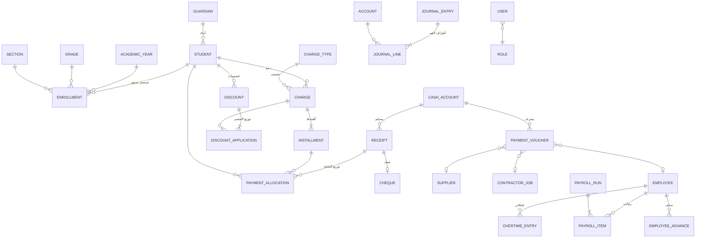

# 2. تصميم قاعدة البيانات (Database Schema)

> المصدر الرسمي والتفصيلي للمخطط هو الملف `prisma/schema.prisma`. هذه الوثيقة تشرح الجداول وعلاقاتها وقواعدها بلغة واضحة.

## 2.1 قواعد عامة

| القاعدة | التطبيق |
|---------|---------|
| المبالغ | نوع `NUMERIC(15,3)` دائمًا — لا نصوص ولا Float |
| التواريخ المالية | نوع `DATE` (تاريخ السند، الاستحقاق، التوظيف...) |
| أوقات التسجيل | `TIMESTAMPTZ` (`createdAt`, `updatedAt`, `cancelledAt`) |
| المعرّفات | أرقام تسلسلية `id` داخلية + أرقام عمل ظاهرة (رقم الطالب، رقم السند) لها قيد تفرّد `UNIQUE` |
| الحذف | الحركات المالية **لا تُحذف**: حقل `status` = `ACTIVE`/`CANCELLED` مع `cancelledAt`, `cancelledById`, `cancelReason`. البيانات الرئيسية (طالب، موظف، مورد) **تُعطّل** ولا تُحذف إذا كان لها حركات |
| من أنشأ السجل | `createdById` على كل حركة مالية |
| الأرصدة المخزنة | حقول مثل `paidAmount` في الأقساط تُحدَّث داخل نفس المعاملة، ومصدرها الحقيقي جداول التوزيع؛ وتوجد أداة تعيد حسابها للتحقق |
| القيود على مستوى القاعدة | `CHECK` لمنع المبالغ السالبة، وتريجر مؤجّل يمنع حفظ قيد غير متوازن، وتريجر يمنع تعديل/حذف سجل النشاط |

## 2.2 مخطط العلاقات الأساسي



## 2.3 الجداول حسب المجموعة

### أ) المستخدمون والأمان

| الجدول | الوصف | أهم الحقول |
|--------|-------|-----------|
| `users` | المستخدمون | `username` (فريد)، `fullName`، `passwordHash`، `roleId`، `extraPermissions[]`، `revokedPermissions[]`، `isActive`، `failedLoginCount`، `lockedUntil`، `lastLoginAt`، `mustChangePassword` |
| `roles` | الأدوار | `key` (للأدوار النظامية)، `name`، `permissions[]`، `isSystem` |
| `sessions` | الجلسات | `id` = SHA-256 لرمز الجلسة، `userId`، `expiresAt`، `lastSeenAt`، `ip`، `userAgent` |
| `login_attempts` | محاولات الدخول | `username`، `userId`، `success`، `reason`، `ip`، `userAgent`، `createdAt` |
| `audit_logs` | سجل النشاط | `userId`، `userName`، `action`، `entityType`، `entityId`، `entityLabel`، `summary`، `before` (JSON)، `after` (JSON)، `ip`، `createdAt` |
| `partners` | الشركاء | `name`، `phone`، `ownershipPercent`، `userId` (حساب الدخول)، `isActive`، `capitalAccountId`، `drawingsAccountId` |

**الصلاحية الفعلية للمستخدم** = (صلاحيات الدور ∪ `extraPermissions`) − `revokedPermissions`.

### ب) الإعدادات والهيكل المدرسي

| الجدول | الوصف | أهم الحقول |
|--------|-------|-----------|
| `settings` | إعدادات مفتاح/قيمة (JSON) | `school`، `finance`، `numbering`، `print`، `payroll`، `security`، `backup` |
| `academic_years` | السنوات الدراسية/المالية | `name` (2026/2027)، `startDate`، `endDate`، `status` (OPEN/CLOSED)، `isCurrent`، `closingEntryId` |
| `stages` | المراحل | `name`، `sortOrder` |
| `grades` | الصفوف | `name`، `stageId`، `sortOrder`، `nextGradeId` (للترحيل)، `isActive` |
| `sections` | الشعب | `gradeId`، `name` — فريد لكل صف |
| `number_sequences` | عدادات الترقيم | `key` (مثل `RECEIPT:2026`)، `lastValue` |

### ج) الطلاب والذمم

| الجدول | الوصف | أهم الحقول |
|--------|-------|-----------|
| `guardians` | أولياء الأمور (حساب العائلة) | `name`، `phone`، `phone2`، `relation`، `nationalId`، `address`، `searchText` |
| `students` | الطلاب | `studentNumber` (فريد تلقائي)، `schoolNumber` (الرقم المدرسي)، `fullName`، `gender`، `birthDate`، `guardianId`، `status` (ACTIVE/WITHDRAWN/GRADUATED/SUSPENDED)، `searchText` |
| `enrollments` | تسجيل الطالب في سنة | `studentId`، `academicYearId`، `gradeId`، `sectionId`، `status` — **فريد (طالب، سنة)**؛ الترحيل ينشئ سجلًا جديدًا ولا يعدّل القديم |
| `charge_types` | تصنيفات الذمم | `name`، `revenueAccountId` (حساب الإيراد المرتبط)، `defaultAmount`، `allowInstallments`، `systemKey` |
| `fee_plans` | الرسوم المقررة لكل صف وسنة | `academicYearId`، `gradeId`، `chargeTypeId`، `amount`، `installmentsCount`، `firstDueDate`، `dueDay` |
| `charges` | **الذمم** | `studentId`، `chargeTypeId`، `academicYearId`، `date`، `grossAmount` (قبل الخصم)، `discountAmount`، `netAmount` (بعد الخصم)، `paidAmount`، `paymentStatus`، `isInstallment`، `status`، `journalEntryId` |
| `installments` | **الأقساط** (كل ذمة لها قسط واحد على الأقل) | `chargeId`، `studentId`، `number`، `dueDate`، `amount`، `paidAmount`، `status` (UNPAID/PARTIAL/PAID/CANCELLED)، `paidAt` |
| `discount_types` | أنواع الخصم | `name` (خصم إخوة، موظفين، تفوق...)، `defaultMethod`، `defaultValue` |
| `discounts` | **الخصومات** | `studentId`، `discountTypeId`، `scope` (CHARGE/CHARGE_TYPE/ACCOUNT)، `method` (PERCENT/FIXED)، `value`، `baseAmount` (قبل)، `amount` (قيمة الخصم)، `netAmount` (بعد)، `reason`، `approvedBy`، `date`، `status` |
| `discount_applications` | توزيع الخصم على الذمم | `discountId`، `chargeId`، `baseAmount`، `amount` |
| `student_discount_rules` | خصومات دائمة تُطبّق تلقائيًا عند إصدار الذمم | `studentId`، `discountTypeId`، `method`، `value`، `chargeTypeId`، `academicYearId`، `isActive` |

> **حالة القسط الزمنية** (غير مستحق / مستحق / متأخر) **لا تُخزّن** لأنها تتغير مع مرور الأيام، بل تُحسب لحظيًا من `dueDate` و«اليوم» وعدد أيام السماح. المخزّن هو حالة السداد فقط.

### د) القبض والصرف والخزينة

| الجدول | الوصف | أهم الحقول |
|--------|-------|-----------|
| `cash_accounts` | الصناديق والحسابات البنكية | `name`، `type` (CASHBOX/BANK)، `bankName`، `accountNumber`، `iban`، `glAccountId`، `lowBalanceAlert`، `isDefault` |
| `receipts` | **سندات القبض** | `number` (فريد)، `kind` (STUDENT/FAMILY/OTHER_REVENUE/PARTNER_CAPITAL/OPENING_CREDIT)، `date`، `payerName`، `studentId`، `guardianId`، `amount`، `paymentMethod`، `cashAccountId`، `revenueAccountId`، `description`، `status`، `journalEntryId` |
| `payment_allocations` | توزيع مبلغ السند | `receiptId`، `studentId`، `chargeId`، `installmentId`، `refundVoucherId`، `amount` — **مجموع توزيعات السند = مبلغه دائمًا**؛ التوزيع بدون قسط = رصيد دائن للطالب |
| `cheques` | الشيكات الواردة والصادرة | `direction`، `number`، `bankName`، `dueDate`، `amount`، `status` (IN_PORTFOLIO/CLEARED/BOUNCED/ISSUED/CANCELLED)، `receiptId`، `voucherId` |
| `payment_vouchers` | **سندات الصرف** | `number` (فريد)، `kind` (EXPENSE/SUPPLIER_PAYMENT/CONTRACTOR_PAYMENT/SALARY/ADVANCE/STUDENT_REFUND/PARTNER_WITHDRAWAL/OTHER)، `date`، `payeeName`، `amount`، `paymentMethod`، `cashAccountId`، `expenseAccountId`، روابط (`supplierId`، `contractorJobId`، `employeeId`، `payrollItemId`، `advanceId`، `studentId`، `partnerId`)، `status` |
| `cash_transfers` | التحويل بين الصناديق والبنوك | `number`، `date`، `fromAccountId`، `toAccountId`، `amount`، `status` |
| `attachments` | المرفقات | `entityType`، `entityId`، `fileName`، `originalName`، `mimeType`، `size`، `uploadedById` |

### هـ) الموردون والمقاولون

| الجدول | الوصف | أهم الحقول |
|--------|-------|-----------|
| `suppliers` | الموردون | `name`، `category`، `phone`، `contactPerson`، `address`، `isActive` |
| `supplier_bills` | فواتير/مطالبات الموردين (شراء بالآجل) | `number`، `supplierInvoiceNo`، `supplierId`، `date`، `expenseAccountId`، `amount`، `status` |
| `contractors` | العمال الخارجيون والمقاولون | `name`، `specialty` (نجار، دهين، كهربائي...)، `phone`، `isActive` |
| `contractor_jobs` | الاتفاقيات/الأعمال | `contractorId`، `description`، `agreedAmount` (قيمة الاتفاق)، `paidAmount`، `startDate`، `endDate`، `expenseAccountId`، `status` |

### و) الموظفون والرواتب

| الجدول | الوصف | أهم الحقول |
|--------|-------|-----------|
| `employees` | الموظفون والمعلمات | `employeeNumber`، `fullName`، `phone`، `jobTitle`، `department`، `isTeacher`، `hireDate`، `salaryType` (MONTHLY/DAILY/HOURLY)، `baseSalary`، `overtimeRate`، `bankName`، `bankAccount`، `status` |
| `overtime_entries` | الساعات الإضافية | `employeeId`، `date`، `hours`، `rate`، `amount` = الساعات × السعر، `reason`، `payrollItemId` |
| `employee_advances` | السلف | `employeeId`، `date`، `amount`، `installmentsCount`، `monthlyDeduction`، `deductedAmount`، `status`، `voucherId` |
| `advance_deductions` | أقساط السلف المخصومة من الرواتب | `advanceId`، `payrollItemId`، `amount` |
| `payroll_runs` | مسير رواتب شهر | `year`، `month`، `status` (DRAFT/APPROVED/CANCELLED)، `totalGross`، `totalNet`، `journalEntryId` |
| `payroll_items` | راتب موظف في المسير | الراتب الأساسي، أيام العمل، الغياب وخصمه، التأخير وخصمه، الإضافي، المكافآت، البدلات، الخصومات، الاستقطاعات، قسط السلفة، `grossPay`، `totalDeductions`، `netPay`، `paidAmount` |

### ز) المحاسبة العامة

| الجدول | الوصف | أهم الحقول |
|--------|-------|-----------|
| `accounts` | دليل الحسابات (شجري) | `code` (فريد)، `name`، `type` (ASSET/LIABILITY/EQUITY/REVENUE/EXPENSE)، `parentId`، `isGroup`، `systemKey`، `isActive` |
| `journal_entries` | القيود اليومية | `number` (JE-2026-000001)، `date`، `description`، `sourceType`، `sourceId`، `status`، `reversalOfId`، `totalAmount` |
| `journal_lines` | أطراف القيد | `entryId`، `accountId`، `debit`، `credit`، `date`، وأبعاد تحليلية: `studentId`، `employeeId`، `supplierId`، `contractorId`، `partnerId` |

> الأبعاد التحليلية في أطراف القيد هي ما يجعل كشف حساب الطالب أو المورد أو الموظف مطابقًا تمامًا للدفاتر العامة.

### ح) الاستيراد والنسخ

| الجدول | الوصف |
|--------|-------|
| `import_batches` | عملية استيراد: النوع، اسم الملف، البيانات المقروءة، ربط الأعمدة، الأخطاء، عدد الصفوف المستوردة، الحالة |
| (ملفات) | النسخ الاحتياطية تُحفظ كملفات مشفرة مع ملف وصف JSON بجانبها (خارج القاعدة حتى لا تضيع سجلاتها عند الاستعادة) |

## 2.4 القيود الحامية للبيانات على مستوى القاعدة

```sql
-- لا مبالغ سالبة
CHECK ("amount" >= 0)
-- طرف القيد إما مدين أو دائن
CHECK ("debit" >= 0 AND "credit" >= 0 AND NOT ("debit" > 0 AND "credit" > 0))
-- القيد يجب أن يكون متوازنًا: تريجر مؤجّل (DEFERRABLE INITIALLY DEFERRED)
-- يتحقق عند COMMIT أن مجموع المدين = مجموع الدائن لكل قيد
-- سجل النشاط: تريجر يرفض UPDATE و DELETE
```

## 2.5 الفهارس الأساسية

- `students(searchText)` و `guardians(searchText)` و `employees(searchText)`... بفهرس `pg_trgm` (GIN) للبحث السريع بالاسم أو الرقم أو الهاتف.
- `installments(dueDate, status)` لتقارير المستحقات والمتأخرات.
- `journal_lines(accountId, date)` و `journal_lines(studentId, date)` لكشوف الحسابات والأرصدة.
- `receipts(date)`، `payment_vouchers(date)`، `audit_logs(createdAt)`، `audit_logs(entityType, entityId)`.
