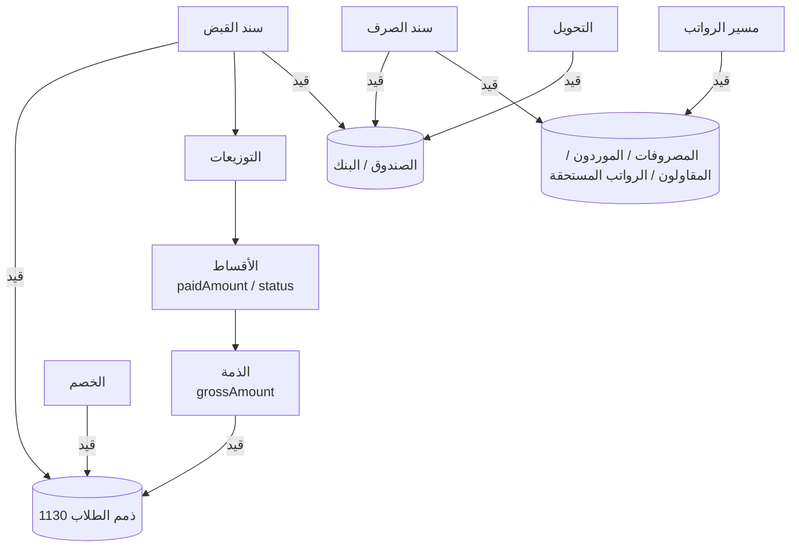

# 13. العلاقات المحاسبية بين أجزاء النظام

## 13.1 الفكرة

المستخدم يتعامل مع **مستندات مفهومة** (ذمة، خصم، سند قبض، سند صرف، مسير رواتب، تحويل)، وكل مستند يُنشئ في الخلفية **قيد يومية مزدوج** (مدين = دائن) في نفس المعاملة. بهذا تكون الدفاتر العامة (الأستاذ، ميزان المراجعة، قائمة الدخل، الميزانية) صحيحة دائمًا ومتطابقة مع الشاشات البسيطة.

كل طرف قيد يحمل **بُعدًا تحليليًا** (الطالب، الموظف، المورد، المقاول، الشريك)، فيصبح كشف حساب أي طرف مستخرجًا من الدفاتر نفسها.

## 13.2 دليل الحسابات الافتراضي

| الرمز | الحساب | النوع | ملاحظة |
|------|--------|------|--------|
| **1** | **الأصول** | أصول | |
| 111 | النقدية في الصناديق | | حساب فرعي لكل صندوق (11101 الصندوق الرئيسي...) |
| 112 | النقدية في البنوك | | حساب فرعي لكل بنك |
| 1130 | ذمم الطلاب | | بُعد: الطالب |
| 1140 | شيكات برسم التحصيل | | الشيكات الواردة في الحافظة |
| 1150 | سلف الموظفين | | بُعد: الموظف |
| 1160 | ذمم مدينة أخرى | | |
| 12xx | الأصول الثابتة (أثاث، أجهزة، وسائل نقل) | | للاستخدام المتقدم |
| **2** | **الالتزامات** | التزامات | |
| 2110 | ذمم الموردين | | بُعد: المورد |
| 2120 | ذمم المقاولين والعمال | | بُعد: المقاول |
| 2130 | رواتب مستحقة الدفع | | بُعد: الموظف |
| 2140 | استقطاعات مستحقة الدفع | | ضمان، ضرائب... |
| 2150 | أمانات ودائنون آخرون | | |
| **3** | **حقوق الملكية** | ملكية | |
| 31xx | رأس مال الشركاء | | حساب لكل شريك |
| 32xx | جاري الشركاء (السحوبات والأرباح الموزعة) | | حساب لكل شريك |
| 3300 | الأرباح المحتجزة | | يُغذى بقيد الإقفال |
| 3400 | أرصدة افتتاحية | | عند الانتقال من نظام قديم |
| **4** | **الإيرادات** | إيرادات | |
| 41xx | إيرادات الرسوم (رسوم مدرسية، أقساط، تسجيل، كتب، زي، مطعم، باص، أنشطة، رحلات، امتحانات، تأمين، إضافية، خدمات أخرى) | | كل **تصنيف ذمة** مرتبط بحساب هنا |
| 42xx | إيرادات أخرى (تبرعات، متنوعة) | | تصنيفات الإيرادات الأخرى |
| 4900 | الخصومات والإعفاءات الممنوحة | مقابل إيراد (رصيده مدين) | يُظهر إجمالي الخصومات بوضوح |
| **5** | **المصروفات** | مصروفات | |
| 5101 | الرواتب والأجور | | من مسيرات الرواتب |
| 52xx | المصروفات التشغيلية (إيجار، كهرباء، مياه، إنترنت، صيانة، قرطاسية، كتب، زي، طعام، نقل، وقود، نظافة، أثاث، أجهزة، تسويق، إدارية، أخرى) | | كل **تصنيف مصروف** هو حساب هنا |

- إنشاء **تصنيف ذمة / مصروف / إيراد جديد** من الواجهة يُنشئ حسابه الفرعي تلقائيًا برمز متسلسل تحت المجموعة الصحيحة.
- إنشاء **صندوق أو حساب بنكي** أو **شريك** يُنشئ حساباته الفرعية تلقائيًا.

## 13.3 القيد الخلفي لكل عملية

| العملية | مدين (م) | دائن (د) | البُعد |
|---------|---------|---------|--------|
| إضافة ذمة لطالب | 1130 ذمم الطلاب — بالمبلغ قبل الخصم | 41xx إيراد نوع الذمة | الطالب |
| خصم على ذمة | 4900 الخصومات الممنوحة | 1130 ذمم الطلاب | الطالب |
| سند قبض (نقدي/حوالة/بطاقة/إلكتروني) | الصندوق أو البنك | 1130 — سطر لكل طالب بمبلغه | الطالب |
| سند قبض بشيك | 1140 شيكات برسم التحصيل | 1130 | الطالب |
| تحصيل الشيك | البنك | 1140 | — |
| شيك مرتجع | عكس قيد سند القبض | | الطالب |
| رصيد سابق على طالب | 1130 | 3400 أرصدة افتتاحية | الطالب |
| رصيد دائن افتتاحي لطالب | 3400 | 1130 | الطالب |
| إيراد آخر (تبرع...) | الصندوق أو البنك | 42xx | — |
| رأس مال من شريك | الصندوق أو البنك | 31xx رأس مال الشريك | الشريك |
| سند صرف لمصروف | 52xx المصروف | الصندوق أو البنك | (المورد اختياريًا) |
| فاتورة مورد بالآجل | 52xx المصروف | 2110 ذمم الموردين | المورد |
| دفعة لمورد | 2110 | الصندوق أو البنك | المورد |
| عمل/اتفاق مع مقاول | 52xx المصروف | 2120 ذمم المقاولين | المقاول |
| دفعة لمقاول | 2120 | الصندوق أو البنك | المقاول |
| صرف سلفة لموظف | 1150 سلف الموظفين | الصندوق أو البنك | الموظف |
| اعتماد مسير الرواتب | 5101 الرواتب (الإجمالي − الغياب − التأخير − الخصومات) | 2130 رواتب مستحقة (الصافي) + 1150 (قسط السلفة) + 2140 (الاستقطاعات) | الموظف |
| صرف راتب | 2130 | الصندوق أو البنك | الموظف |
| مرتجع لطالب | 1130 | الصندوق أو البنك | الطالب |
| سحب شريك | 32xx جاري الشريك | الصندوق أو البنك | الشريك |
| تحويل بين صندوق/بنك | الحساب المحوَّل إليه | الحساب المحوَّل منه | — |
| رصيد افتتاحي لصندوق/بنك | الصندوق/البنك | 3400 | — |
| إقفال السنة | كل حسابات الإيرادات (رصيدها) | كل المصروفات + 4900، والفرق إلى 3300 الأرباح المحتجزة | — |
| توزيع صافي الربح (اختياري) | 3300 | 32xx لكل شريك حسب نسبته | الشريك |
| **أي إلغاء** | **قيد عكسي مطابق تمامًا للقيد الأصلي** بتاريخ الإلغاء، والقيد الأصلي يبقى ويُعلَّم «معكوس» | | |

> **لماذا الذمة تُسجل بالمبلغ قبل الخصم والخصم بقيد مستقل؟** حتى تظهر الإيرادات الأصلية والخصومات الممنوحة كلٌ على حدة في التقارير (كم كان يجب أن نحصّل، وكم تنازلنا عنه).

## 13.4 العلاقات بين الجداول التشغيلية والدفاتر

## 13.5 قواعد التطابق (تُفحص آليًا في «فحص سلامة البيانات» وفي الاختبارات)

1. كل قيد: مجموع المدين = مجموع الدائن (مضمون أيضًا بتريجر في القاعدة).
2. ميزان المراجعة: مجموع كل الأرصدة المدينة = مجموع الأرصدة الدائنة.
3. لكل طالب: رصيده في 1130 = مجموع الذمم − الخصومات − المقبوض + المرتجع.
4. لكل ذمة: مجموع أقساطها الفعالة = صافي الذمة؛ والمدفوع = مجموع التوزيعات من سندات فعالة.
5. لكل سند قبض: مجموع توزيعاته = مبلغه.
6. لكل صندوق/بنك: الرصيد المعروض = رصيد حسابه في الأستاذ.
7. لكل موظف: رصيد 2130 = صافي الرواتب المعتمدة − المصروف له؛ ورصيد 1150 = السلف − الأقساط المخصومة.
8. لكل مورد: رصيد 2110 = الفواتير − الدفعات. لكل مقاول: رصيد 2120 = قيم الاتفاقات − الدفعات.
9. تسلسل أرقام السندات بلا فجوات.

## 13.6 كيف تُحسب التقارير المالية

| التقرير | الحساب |
|---------|--------|
| **قائمة الدخل (الأرباح والخسائر)** لفترة | الإيرادات (41 + 42) − الخصومات (4900) = صافي الإيرادات؛ − المصروفات (5) = **صافي الربح**. تُستثنى قيود الإقفال. ويُعرض بجانبها الملخص النقدي: المقبوض فعليًا، المصروف فعليًا، صافي النقد. وحصة كل شريك حسب نسبته |
| **الميزانية العمومية** في تاريخ | الأصول = الالتزامات + حقوق الملكية + صافي ربح الفترة غير المقفلة |
| **ميزان المراجعة** | مجموع المدين والدائن ورصيد كل حساب |
| **دفتر الأستاذ** | حركات حساب مع الرصيد التراكمي والرصيد الافتتاحي للفترة |
| **رصيد الصندوق / البنك** | رصيد حسابه في الأستاذ في أي تاريخ |
| **كشف حساب طالب** | أطراف القيود على 1130 للطالب: الذمم (مدين)، الخصومات والدفعات (دائن)، المرتجع (مدين)، والإلغاءات، مع الرصيد التراكمي |

## 13.7 الأساس المحاسبي

- **أساس الاستحقاق** للدفاتر: الإيراد يُسجل عند إصدار الذمة، والمصروف عند الفاتورة/الاتفاق/اعتماد الرواتب.
- **الأساس النقدي** متاح في لوحة التحكم والتقارير: التحصيل الفعلي (سندات القبض) والصرف الفعلي (سندات الصرف) وصافي الحركة النقدية.
- كل رقم في لوحة التحكم مكتوب بجانبه أي أساس يعتمد عليه بلغة بسيطة (مثل: «المحصّل فعليًا هذا الشهر»).
